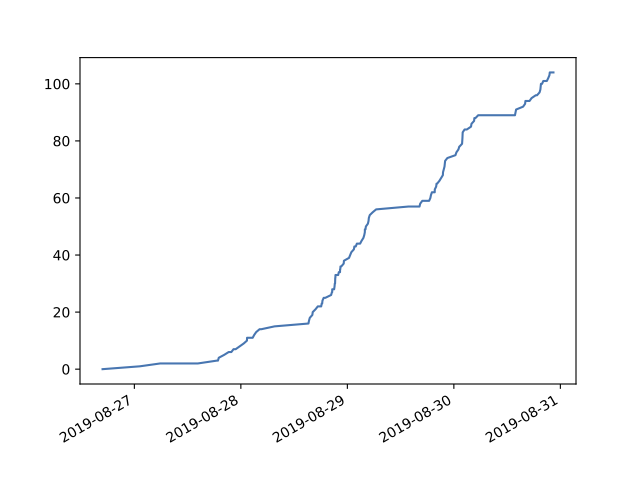

# GitHub Classroom Utils

This repository contains a number of utilities that I've written (and rewritten)
over the years to help with [GitHub Classroom](https://classroom.github.com). 
Most recently (Oct 2019), I revamped the code to launch multiple, concurrent requests
to the GitHub servers whenever possible. These tools now run *significantly* faster.

## Setup

I typically have an administrative repository, private to just the instructors,
where I keep grades, slides, and other materials related to running my classroom. 
I'll copy these utilities to that directory and configure them to operate on the
student repositories for just that class.

## Installation & Configuration

1) If you haven't already done this, you'll first need to `pip3 install
iso8601 pandas matplotlib requests aiohttp` for necessary libraries.
(Everything here requires Python3 and is tested with Python 3.7.2.
 Earlier versions of Python3 might or might not work.)
 
2) Copy all the `py` files here into your class administrative repository.

3) Get a GitHub token with all the "Repo" privileges. You do
this on the GitHub website
[(instructions)](https://github.com/blog/1509-personal-api-tokens). 

4) Edit the `github_config.py` file. In this file
   you can save values that every tool here will use.
   These parameters can be specified on the command-line
      for every tool here, but it's nice to save them so you're
      not typing them over and over again.
    
   - `default_github_organization`: Your organization's name
   (e.g., for `https://github.com/RiceComp215-Fall2018`, the
   organization name is `RiceComp215-Fall2018`). 
   
   - `default_github_token`: Your API token goes here.

   - `default_prefix`: When you're cloning and otherwise working
     with a specific assignment for your students, you can specify
     this here. 
     
   - `default_grader_list`: [Used by github_graders, see below](#github_graders)
   
   - `default_grader_ignore_list`: [Used by github_graders, see below](#github_graders)

   - `default_timezone`: [used by github_completion_times, see below](#github_completion_times)
     
      
## Tools

All of these tools use a common library to interact with GitHub that tries
to avoid rescanning student repositories unless something has changed.
These scans can take a while to run and also burn through your available
GitHub API request limit, so it's important to cache the results. (You'll
see a multi-megabyte JSON file written out as a dot-file in the current directory.)

The cache uses the 
[ETag headers](https://developer.mozilla.org/en-US/docs/Web/HTTP/Headers/ETag)
generated by GitHub to try to avoid repeated downloads of identical lists
of all the student repositories. 
[GitHub's implementation of ETag](https://developer.github.com/v3/#conditional-requests) 
seems to be unreliable, so you'll be wanting to manually delete the cache
if you know that your students have created new repositories. You
do this by removing the cache file, which has a name like
`.github-classroom-utils.RiceComp427-Spring2019.json`).
This forces a rescan of the students' repositories the next time
you run one of the tools here.

**Tool usage.** Each tool below let's you run it with a `--help` argument which will summarize
the command-line arguments. 

### github_clone_all

You often want to get a local copy of every repo beginning with a common prefix,
e.g., `comp215-week06` for the week6 projects.
Run `python3 github_clone_all.py --prefix comp215-week06 --out codedump-week06`
and it will create the directory `codedump-week06` and will check out all
of the matching repos into the desired directory.

An optional flag, `--safe`, creates repositories that do not have your
API token embedded in them. This means that remote Git actions that
require the token might not work, but the repos are safer to share.
By default, the API token is embedded in the cloned Git repos.

### github_rate_limit

If you keep running these tools, you'll eventually hit the wall with
GitHub's rate limits. This tool tells you how many requests you have
left and when the timer will reset.

### github_private_all

If you checked the wrong box when setting up GitHub Classroom, and all
your students' repositories are public, when you meant them to be private,
you can go back into GitHub Classroom's settings and make sure that *future*
cloned repositories will be private, but what about the existing ones? This
tool will tell GitHub to make private all the matching repositories. (I've
needed this twice in so many years, so I figure others might need this as well.)

### github_no_partners

You tell the students that they're required to have a partner, or to have
a minimum group size. How do you detect the missing students? This script
does all that. It scans all the projects, extracts the teams, and lets
you know about any project with fewer than the minimum number of members.
Likewise, if there are students in your database who aren't attached to
any GitHub projects, you get their information as well.

### github_graders

If you're using GitHub Classroom, one of the things you may need to do is assign
student submissions to graders. This project does this as a random mapping,
printing a document that you might share with your graders on Piazza or whatever
forum, with grader names and student project hyperlinks.

First, create a list of GitHub IDs that correspond to your graders and
place that in the `default_grader_list` in `github_config.py`.
This tells the tool who your graders are, and also any repos that they
might have cloned for their own benefit will be ignored. If you want to
ignore any other names, such as the professors, you can add them to
`default_grader_ignore_list`.

Our graders need to know how to go from GitHub identifiers to our
internal NetIDs, emails, and so forth. The tool will read in a CSV
file with all this specified (by default, `student-data.csv`). To
the extent anything is standard in the CSV universe, the first row
should be a list of strings giving the names of each column. We
use a `GitHubID` column for GitHub user ids, and then `Name` for
their printable name, `Email` for their full university email address,
and `NetID` for their university unique "network" identifier (which
is often, but not always, their email address).

For group projects, github_graders still does the assignments at
random, but it cannot print all this per-user information, since
the user names aren't always in the project name. We make our
students edit the `README.md` file to include this information.
 
Typical usage: `python3 github_graders.py --prefix comp215-week06` will 
print out everything you need, assuming your assignment repos are named `comp215-week06`
with the students' names afterward. 

A new feature, `--teams` is useful when students are working as teams
with GitHub Classroom. This will use GitHub's APIs to identify the
names of each student associated with each repo and will adjust its
printed output appropriately.

Another new feature, `--ignore` lets you specify a substring of a repo
name to ignore when assigning grading. We tell our graders, when they
want to check out a repo to play with it, to add the word `STAFF` in
the name. This helps us skip those so they don't get assigned to be
graded.

The output of this tool is in Markdown format, which Piazza has recently added.
Select the Markdown button before cutting-and-pasting. We post this on Piazza,
visible only to the graders, and we ask the graders to edit the post to mark the
students as "done" when they're done with their grading session. (This helps us see
what graders haven't finished their work and, if necessary, assign other
graders to pick up the slack.)

### github_event_times

This program uses the GitHub "Events" API to print all of the *push* times
for each commit, with its output in LaTeX "tabular" format. This might be
useful if you have a student who you suspect of falsifying commit times
around a deadline and you need to document what happened.

Lets say you want to get the commit times for a series of repos
with
names like `assignment3-student1` and `assignment3-student2`, 
you run `python3 github_event_times.py assignment3-student1
assignment3-student2`
and it will print a table with the commit IDs (7 digit prefix, same
as reported on GitHub's list of commits), the commit string, and the
time at which that commit was pushed to GitHub, converted to your
local timezone (from the UTC times reported by GitHub).

Note that GitHub only retains the underlying event data for a small
amount of time, maybe three months. If you see something unusual, 
capture this output while it's still available.

### github_completion_times

This reads all the available
CI data for every commit in every repo
and produces a plot over time of how many students have passed all
the tests and gotten a green checkmark. Here's an example from my
own students, showing work in progress toward a deadline on 2019-09-01;
you can see roughly 100 of 170 students have completed the work on
the evening of 2019-08-30. 

The timezone used to render the chart is set from the
`default_timezone` setting in `github_config.py`.

## See also

- I did a talk at SIGCSE 2019 about an earlier version of these tools.
  - [Slides](https://www.cs.rice.edu/~dwallach/sigcse2019.pdf)
  - [YouTube video](https://youtu.be/xFPskG4ctsI?t=318)

- For dealing with Travis-CI, check out [travis-activate](https://github.com/danwallach/travis-activate).
  (Travis-CI normally "activates" immediately when a new repository is created,
   but at least once I've seen this fail. This script was something I originally
   ran from a `cron` job to force all repos to "activate" with Travis, years ago,
   when Travis didn't know how to automatically activate new repos.)
   
- https://classroom.github.com/assistant - GitHub's web-based tool for bulk repo downloads ([open source](https://github.com/education/classroom-assistant/))

- https://github.com/dwalkes/github-classroom-scripts - knows how to set up pull requests

- https://github.com/ccannon94/github-classroom-utilties - knows how to clone assignments, add files, and to
  set things up for a run of [MOSS](https://theory.stanford.edu/~aiken/moss/)

- https://github.com/osteele/multiclone - another repo cloning tool, written in Golang

- https://github.com/konzy/mass_clone - there are many forks of this, some with additional features
